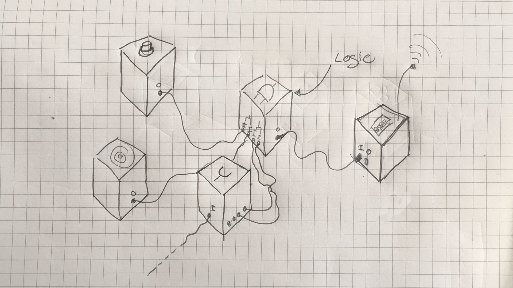

Jack in a Box
=============

  

“Jack in a Box” is attempt to design a prototyping framework for connected devices. As the name says it uses audio jacks as medium for communication. It is based on the master thesis by Victor Vina [“Box. Open System for Connected People”][boxthesis].  

## Type of objects

- input (sensor emits an signal)
- receiver (only receives an signal)
- input/output (sensor/actuator, emitter/receiver)
- self-sufficient emitters (initiator/emitter e.g. pulse)
- switches (relay signal to several outputs)
- logic gates (can be implemented using a micro controller [see][logic])
- gateway/interfaces (to remote resources can be emitter/receiver as well)
- transformers (e.g. delay, counter, storage)

## Design Todos

- [ ] hardware
    + [ ] the actual box
    + [ ] the connection to the jack
    + [ ] pcb?
- [ ] visual language for diagrams
    + [ ] definition for types of objects
    + [ ] connections
- [ ] documentation
    + [ ] setup guides
    + [ ] video
    + [ ] website?

## Technical Constrains

- binary I/O model (HIGH/LOW)
- No central hub
- I/O via 6.35 mm Jack
- common ground
- 3.3V
- contains power source (lipoly)

## Possible Hardware

- [Adafruit Feather Huzzah ESP 8266][huzzah] (with WiFi)
- [Adafruit Feather Huzzah 32][huzzah] (with WiFi)
- [Adafruit Feather M0 Basic Proto][m0] (no WiFi)
- [Arduino Micro 3.3v][micro] (no WiFi) 
- ~~Particle Photon~~[^1]

## First Proof of Concept (POC)

For a first proof of concept see the [Jack in a Box Arduino Library][jack]. 

## Contributors 

- [@fabianmoronzirfas][ghuser]
- [@paulroeder][ghuser2]
- [@DerCritter][ghuser3]
- [@n-botthof][ghuser4]
- [@sujingL][ghuser5]

[^1]: To add not to much overhead (cloud connection, Node.js, etc) we wont be using the Photon boards. 

[micro]: https://ex-store.de/Arduino-Pro-Mini-328-3V3-8MHz-kompatibles-Board
[jack]: https://github.com/fabianmoronzirfas/Jack
[ghuser]: https://github.com/fabianmoronzirfas
[ghuser2]: https://github.com/paulroeder
[ghuser3]: https://github.com/DerCritter
[ghuser4]: https://github.com/n-botthof
[ghuser5]: https://github.com/sujingL
[boxthesis]: http://projectsfinal.interactionivrea.org/2001-2002/Summer%20Research%202001/presentations/report/box/box_thesis.pdf  
[logic]: https://github.com/fabianmoronzirfas/electrical-engineering/blob/master/logic/logic-gates.mdown
[huzzah]: https://learn.adafruit.com/adafruit-feather-huzzah-esp8266 "Tutorial about the board"
[huzzah32]: https://learn.adafruit.com/adafruit-huzzah32-esp32-feather/overview
[m0]: https://learn.adafruit.com/adafruit-feather-m0-basic-proto/ "Tutorial about the board"
